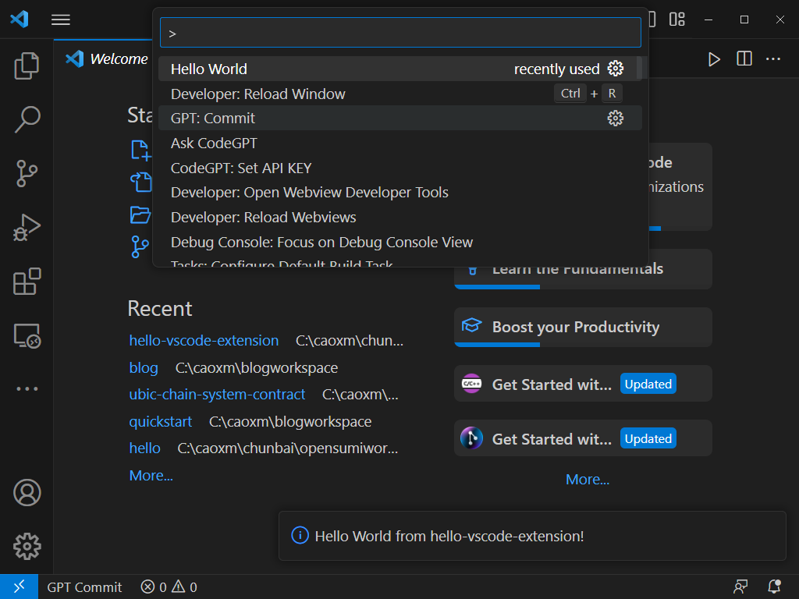

opensumi extension docs [如何开发插件|opensumi](https://opensumi.com/zh/docs/extension/overview)

vscode extension docs [Extension Guide|Visual studio Code Extension API](https://code.visualstudio.com/api/extension-guides/overview)

<!--more-->

### 1. learning things about vscode extensions

- vscode extension hello world:

  this example mainly about the `command` registery.

  - install yo cli:

    ```
    npm install -g yo generator-code
    ```

  - generate project dir:

    ```
    yo code
    ```

  - press `f5`, running editor, then `ctrl + shift + p`, input `hello`, run `helloWorld`:

  

  #### conclusion:

  The Hello World extension does 3 things:

  - Registers the `onCommand` [Activation Event](https://code.visualstudio.com/api/references/activation-events): `onCommand:helloworld.helloWorld`, so the extension becomes activated when user runs the `Hello World` command. in `src/extension.ts`

  ```typescript
  export function activate(context: vscode.ExtensionContext) {
    // in here...
  }
  ```

  - Uses the `contributes.commands` [Contribution Point](https://code.visualstudio.com/api/references/contribution-points) to make the command `Hello World` available in the Command Palette, and bind it to a command ID `helloworld.helloWorld`. in `package.json`

  ```json
  "contributes": {
   "commands": [
     {
       "command": "hello-vscode-extension.helloWorld",
       "title": "Hello VScode" // name of command
     }
   ]
  }
  ```

  - Uses the `commands.registerCommand` [VS Code API](https://code.visualstudio.com/api/references/vscode-api) to bind a function to the registered command ID `helloworld.helloWorld`. register and deal with command in `src/extension.ts`

  ```typescript
  let currentTimeDisposable = vscode.commands.registerCommand(
    "hello-vscode-extension.currentTime",
    () => {
      vscode.window.showWarningMessage(
        `Hello ${new Date().toLocaleDateString()}`
      );
    }
  );
  context.subscriptions.push(currentTimeDisposable);
  ```

### 2. Extensions Capabilities Overview

- 1. Commands- [ built-in commands ](https://code.visualstudio.com/api/references/commands)

  The `editor.action.addCommentLine` command, for example, comments the currently selected lines in the active text editor:

  ```typescript
  import * as vscode from "vscode";

  vscode.commands.executeCommand("editor.action.addCommentLine");
  // commands take arguments,  return a result
  const definitions = await vscode.commands.executeCommand<vscode.Location[]>(
    "vscode.executeDefinitionProvider",
    activeEditor.document.uri,
    activeEditor.selection.active
  );
  ```

- 2.  Tree View

      - 1> using the contributes.views Contribution Point in package.json.

        ```json
        {
          "contributes": {
            "views": {
              "explorer": [
                {
                  "id": "nodeDependencies",
                  "name": "Node Dependencies"
                }
              ]
            }
          }
        }
        ```

      - 2> The second step is to provide data to the view you registered so that VS Code can display the data in the view.

      ```typescript
      export class DepNodeProvider
        implements vscode.TreeDataProvider<Dependency> {
        // implemants
      }
      ```

      - 3> The third step is to register the above data provider to your view.

      ```typescript
      const rootPath =
        vscode.workspace.workspaceFolders &&
        vscode.workspace.workspaceFolders.length > 0
          ? vscode.workspace.workspaceFolders[0].uri.fsPath
          : undefined;
      vscode.window.registerTreeDataProvider(
        "nodeDependencies",
        new NodeDependenciesProvider(rootPath)
      );
      // or

      vscode.window.createTreeView("nodeDependencies", {
        treeDataProvider: new NodeDependenciesProvider(rootPath),
      });
      ```

      [vscode extension manifest](https://code.visualstudio.com/api/references/extension-manifest)

- **Note:** Use the online reference of [Supported TeX Functions](https://katex.org/docs/supported.html)
