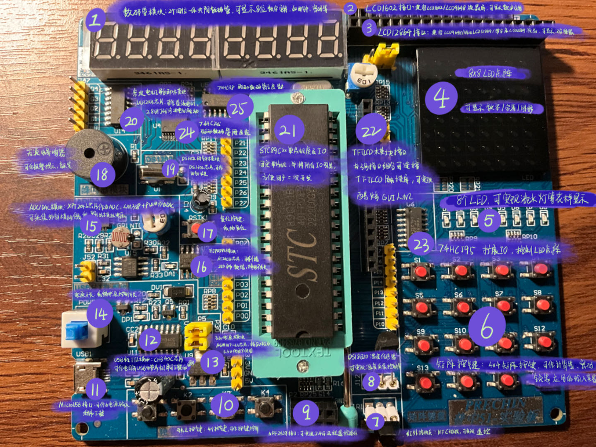

<!--more-->

### 1. 开发板功能介绍：

### 2. STC89Cxx 芯片介绍

51 单片机特指兼容 Intel 8031 指令系统的单片机统称。

| STC  | 8    | 9          | C    | 5    | 2        | RC       |
| ---- | ---- | ---------- | ---- | ---- | -------- | -------- |
| 宏晶 | 8051 | 内部 Flash | CMOS | 固定 | 2^2k Rom | 512b ram |

| 40  | I            | PDIP40           | 19    | 47  | H0XN.X90C     |
| --- | ------------ | ---------------- | ----- | --- | ------------- |
| 40m | 工业级 40-80 | 封装(双列直插式) | 19 年 | 周  | 不详/制造工艺 |

---

| 标志 | RAM   |
| ---- | ----- |
| RC   | 512B  |
| RD+  | 1280B |

| 级别 | 温度           |
| ---- | -------------- |
| I    | 工业级 40-80   |
| C    | 商用级 0-75    |
| A    | 汽车级 -40-125 |
| M    | 军用级 -55-150 |

### 3. 封装脚识别

LQFP 小圈
DIP40 半圈
PLCC 半圈

### 4. 51 单片机能做什么

智能手环、飞行器、平衡车、扫地机、pos 机，可能会用高端芯片

1、外设 GPIO、外部中断、定时器、串口
2、数字电路、模拟电路知识
3、C 语言能力
4、多动手编程
5、遇到问题多百度多浏览论坛
